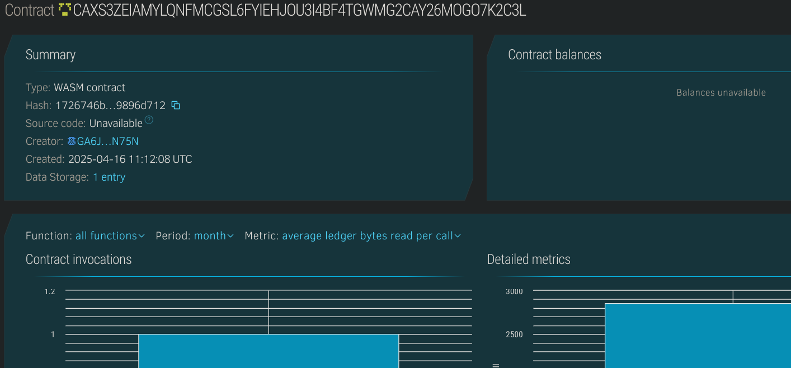

# Job Board dApp

## 🧠 Project Description
The Job Board dApp is a decentralized platform that connects job seekers with employers. Built on the Stellar blockchain using Soroban smart contracts, it allows users to post, view, and apply for jobs in a secure, transparent, and censorship-resistant way.

## 🎯 Project Vision
To decentralize the job marketplace, empowering both employers and job seekers with fair access to opportunities while removing intermediaries.

## 🔑 Key Features
- 📝 Post new job listings (by employers)
- 🔍 Browse all listed jobs (by job seekers)
- 📨 Apply to jobs (optional future upgrade)
- 🔐 Immutable and transparent job board

## 🚀 Future Scope
- Role-based access (employer/job seeker)
- Job application tracking
- On-chain verification of skills/credentials
- Decentralized identity for resume verification
- Reputation system for employers and applicants

## 📦 Tech Stack
- Soroban Smart Contracts (Rust)
- Stellar Blockchain
- Soroban CLI and SDK

## Contract Details
CAXS3ZEIAMYLQNFMCGSL6FYIEHJOU3I4BF4TGWMG2CAY26MOGO7K2C3L
